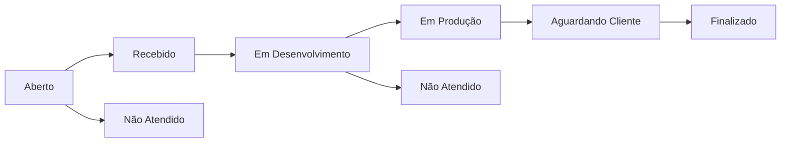

# TOC — Template Orquestrador de Chamados

Sistema de gestão de chamados desenvolvido para o **Núcleo de Automação de Procedimentos do TJGO**, integrado ao Orquestrador DPE.

---

## Stack Tecnológica

- **Backend**: Django 6.x + Python 3.12
- **Frontend**: Django Templates + HTMX 2.x + Alpine.js 3.x + Bootstrap 5.3
- **Banco de Dados**: PostgreSQL 17
- **Storage**: S3-compatible (via django-storages)
- **Autenticação**: django-allauth (utilizando email como identificador principal)

---

## Pré-requisitos

- Python 3.12+
- PostgreSQL 17 (via contêiner Docker ou instalação local)
- Serviço de storage compatível com S3 (via contêiner Docker)
- Git e Docker instalados

---

## Setup de Desenvolvimento

### 1. Clonar o repositório

```bash
git clone git@github.com:murilonegrao/toc.git
cd toc
```

### 2. Configurar o ambiente virtual

```bash
python -m venv venv
source venv/bin/activate  # No Linux/Mac
# venv\Scripts\activate   # No Windows
```

### 3. Instalar as dependências

```bash
pip install -r requirements/development.txt
```

### 4. Configurar as variáveis de ambiente

Copie o arquivo de exemplo e preencha com seus valores:

```bash
cp .env.example .env
```

Consulte o `.env.example` para ver todas as variáveis necessárias e seus formatos.

### 5. Iniciar o banco de dados (PostgreSQL)

```bash
docker run -d \
  --name toc-postgres \
  -p 5432:5432 \
  -e POSTGRES_USER=your_database_user \
  -e POSTGRES_PASSWORD=your_database_password \
  -e POSTGRES_DB=your_database_name \
  postgres:17-alpine
```

Em seguida, acesse o contêiner e conceda as permissões necessárias (obrigatório para o PostgreSQL 15+):

```bash
docker exec -it toc-postgres psql -U your_database_user -d your_database_name
```

```sql
GRANT ALL ON SCHEMA public TO your_database_user;
```

### 6. Iniciar o Storage Local

```bash
docker run -d \
  --name toc-storage \
  -p 9000:9000 \
  -p 9001:9001 \
  -e MINIO_ROOT_USER=your_access_key \
  -e MINIO_ROOT_PASSWORD=your_secret_key \
  minio/minio server /data --console-address ":9001"
```

Acesse o console pelo navegador em `http://localhost:9001` e crie manualmente o bucket configurado no seu `.env`.

### 7. Executar as migrações do banco

```bash
python manage.py migrate
```

### 8. Criar o superusuário

Acesse o shell interativo do Django:

```bash
python manage.py shell
```

E execute o comando para criar um perfil de administrador inicial:

```python
from apps.accounts.models import User

User.objects.create_superuser(
    email='admin@example.com',
    password='sua_senha',
    name='Admin TOC',
    role='admin',
    is_approved=True,
)
```

### 9. Criar registros iniciais (Departamentos)

Aproveitando o shell previamente aberto, cadastre alguns departamentos essenciais para testar o sistema:

```python
from apps.departments.models import Department

Department.objects.create(name='Departamento A', initials='DA', color='#F4645F', active=True)
Department.objects.create(name='Departamento B', initials='DB', color='#4A90D9', active=True)

exit()  # Pressione ENTER para sair do shell interativo
```

### 10. Iniciar o servidor de desenvolvimento

```bash
python manage.py runserver
```

Acesse o sistema no navegador acessando `http://localhost:8000`.

---

## Deploy com Docker Compose

O projeto inclui `Dockerfile` e `compose.yaml` prontos para produção.

### 1. Configurar as variáveis de ambiente

```bash
cp .env.example .env
# Edite o .env com as credenciais reais do ambiente de produção
```

### 2. Subir os serviços

```bash
docker compose up -d --build
```

Isso irá iniciar os serviços de **app**, **banco de dados** e **storage**. O app executa automaticamente as migrações e o `collectstatic` antes de servir via Gunicorn.

### 3. Criar o superusuário no container

```bash
docker compose exec app python manage.py shell
```

E siga o passo 8 do Setup de Desenvolvimento (acima).

---

## Estrutura do Projeto

```text
toc/
├── apps/
│   ├── accounts/        # Controle de usuários, autenticação e aprovações
│   ├── attachments/     # Gerenciador de upload de arquivos para S3
│   ├── comments/        # Lógica de comentários e interações nos chamados
│   ├── core/            # Dashboard principal e views genéricas base
│   ├── departments/     # Gestão dos Departamentos / Centrais do TJGO
│   ├── notifications/   # Log de atividades e disparos
│   └── tickets/         # Módulo principal: Chamados (CRUD, status, histórico)
├── config/
│   └── settings/
│       ├── base.py        # Configurações globais e comuns
│       ├── development.py # Configuração exclusiva de ambiente dev (debug ativado)
│       └── production.py  # Configurações otimizadas para deploy em produção
├── templates/
│   ├── account/         # Sobrescrita das views nativas do django-allauth
│   ├── accounts/        # Templates customizados para o fluxo de contas
│   ├── comments/        # Templates e partials de comentários
│   ├── core/            # Dashboard e views genéricas
│   ├── departments/     # Templates e partials de departamentos
│   ├── tickets/         # Interfaces e formulários de chamados / kanban
│   ├── base_app.html    # Layout base contendo sidebar, topbar e tags base
│   ├── base_pending.html # Layout para tela de aprovação pendente
│   └── base_public.html  # Layout para telas públicas (login, signup)
├── static/
│   └── css/main.css     # Estilos globais complementares (Vanilla CSS)
├── requirements/
│   ├── base.txt
│   ├── development.txt
│   └── production.txt
├── compose.yaml         # Docker Compose para deploy
├── Dockerfile           # Imagem de produção da aplicação
├── .dockerignore        # Arquivos excluídos do build Docker
├── .env.example         # Modelo de variáveis de ambiente
└── manage.py            # CLI do Django
```

---

## Papéis de Usuário (Roles)

| Papel | Acesso / Permissões no Sistema |
|---|---|
| `admin` | Acesso total e irrestrito ao sistema gerencial e Painel do Django Admin |
| `atendente` | Permissão para visualizar/gerir todos os chamados e aprovar novos cadastros de usuários |
| `gestor_unidade` | Visão ampla sobre os chamados gerados dentro de seus respectivos departamentos |
| `cliente` | Visão restrita de apenas consultar e interagir com os seus próprios chamados |

---

## Fluxo de Status dos Chamados

Abaixo está o ciclo de vida padrão que ocorre num andamento de um chamado:

```text
Aberto → Recebido → Em Desenvolvimento → Em Produção → Aguardando Cliente → Finalizado
                  ↘ Não Atendido                     ↘ Não Atendido
```

Para uma melhor visualização do fluxo de estados:



---

## Fluxo de Cadastro de Usuários

1. Usuário prospecto acessa as telas de Login e se cadastra na rota `/accounts/signup/`.
2. Após salvar o usuário simples, ele deve escolher qual o departamento de alocação em `/accounts/select-department/`.
3. Após isso, a conta do servidor do TJ ficará trancada em status **pendente**, redirecionando sempre sua página inicial para `/accounts/pending/`.
4. Um atendente autorizado ou um administrador vai visualizar uma chamada em sua Dashboard em `Aprovações Pendentes` e clicar em `/accounts/pending-users/` para habilitar ou rejeitar a liberação de rede daquele cadastro.
5. Após este _Ok_ de segurança, o usuário passará a integrar oficialmente a listagem acessando as funcionalidades em seu Papel ("Role") respectiva.

---

## Convenções de Commits do Git

Este projeto impõe/sugere a prática de [Conventional Commits](https://www.conventionalcommits.org/):

| Padrão | Cenário a ser adotado |
|---|---|
| `feat:` | Utilizado no lançamento uma nova Feature ou Funcionalidade ao sistema |
| `fix:` | Usado para a correção de algum comportamento anômalo/bug |
| `chore:` | Utilizado quando foram feitos setups de ambiente, mudanças de lib/dependências ou script de configuração CI/CD |
| `docs:` | Quando existem mudanças em documentações e comentários de forma expressiva e substancial (ex: atualizar o README) |
| `refactor:` | Se ocorreu uma refatoração em base de lógica ou banco, sem alterar visivelmente o escopo comportamental final do software |